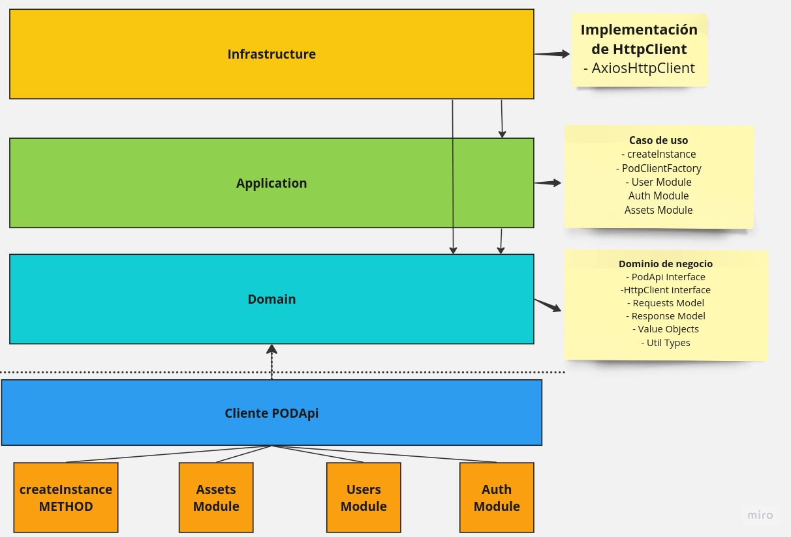

# Pod's technical interview

## Requirements
- Docker (v24.0.5)
- Docker Compose (v2.20.2)
- Ubuntu (v20.04.1 LTS)
  
> **Note:** The project was developed using the versions specified above. It may work with other versions, but it is not guaranteed.

## Main technologies used
- Node.js (v18.15.0)
- Typescript (5.1.6)
- Jest (29.6.2)
- ESlint (8.46.0)
- Axios (1.4.0)
- Faker (8.0.2)

## How to run the project
1. Download the repository
2. Run `docker compose run app npm install` to install npm dependencies
3. Run `docker compose run app npm run test` to run the tests with coverage
   
In addition:   
1. Run `docker compose run app npm run lint` to run the linter
2. Run `docker compose run app npm run test:unit` to run unit tests only
3. Run `docker compose run app npm run example` to run the example/main.ts file
4. Run `docker compose run app <command>` to run any other command inside the container`   

> **Note:** This comands not install the dependencies as docker compose up does. If you want to run them, you need to run `docker compose run app npm install` first.

## Changelog
### Version 0.5.0
- Created get assets count method in PODClient class.
- Created spec test for get assets count method.
- Added API Documentation to README.md
### Version 0.4.1
- Optimized get all assets method.
### Version 0.4.0
- Created get all assets method in PODClient class.
- Created spec test for get all assets method.
- Furthermore, the following additions and changes are listed:
  - Added new unit tests assets domain
### Version 0.3.0
- Created create user method in PODClient class.
- Created spec test for create user method.
- Furthermore, the following additions and changes are listed:
  - Changed the project architecture to DDD Layered Architecture (domain, application, infrastructure)
  - Refactored the code to use the new architecture
  - Added new unit tests for the new architecture
### Version 0.2.0
- Created login method in PODClient class.
- Created spec test for login method.
- Furthermore, the following additions and changes are listed:
  - The first version of the project architecture is implemented. It consists of a domain folder for the business logic and a lib folder for integrations with external dependencies.
  - Unit tests for the business logic are created.
  - The code's specification test is divided into separate files.
  - An `example` folder is added to allow users to use the library and create a sort of playground.
### Version 0.1.0
- Initialized the project using the `npm init` command and installed necessary dependencies.
- Set up tsconfig.json configuration to use Node.js in conjunction with Typescript.
- Installed and configured Jest, initialized the test suite for test specifications, making them fail initially to apply TDD.
- Installed ESLint and necessary plugins to make it work with Typescript. ESLint and Prettier are used together as default rules.

## Architecture

## API Documentation
### Creating client instannce
**createInstance(config: PODClientOptions): PODAPi**

PODClientOptions
| Property  | Definition  | Type |
| -------- | ----------  | --------
| host  | The endpoint host | string
| password     | The password account | string
| username    | The username account |  string

### PODApi Methods

### Auth

**PODApi#auth.login(): Promise<Response<LoginBody\>>**

`Response<LoginBody>`
| Property  | Definition  | Type
| -------- | ----------  |------
| data  | the payload data | LoginBody
| status     | Status Response | number
| statusText    | Status Text Response | string

`LoginBody`
| Property  | Definition  | Type
| -------- | ----------  |------
| token  | The user access token | string
| user     | Info about user | UserBody

### Assets

**PODApi#assets.getAll(accountId: string): Promise<PaginateResponse<AssetBody\>>**

`Response<AssetBody>`
| Property  | Definition  | Type
| -------- | ----------  |------
| data  | the payload data | AssetBody
| status     | Status Response | number
| statusText    | Status Text Response | string

`AssetBody`
>See: src/domain/asset/types/asset-body.ts

**PODApi#assets.getAssetsCount(accountId: string, filter: FilterPayload): Promise<PaginateResponse<AssetsCountBody\>>**

`FilterPayload: "active,inactive,suspended" | "active" | "inactive,suspended" | "inactive" | "suspended" | "active,inactive" | "active,suspended"`

`Response<AssetsCountBody>`
| Property  | Definition  | Type
| -------- | ----------  |------
| data  | the payload data | AssetsCountBody
| status     | Status Response | number
| statusText    | Status Text Response | string

`AssetsCountBody`
| Property  |  Type
| -------- | ------
| active  |  number
| inactive      | number
| suspended     | number

### Users
**PODApi#users.create(user: CreateUserPayload): Promise<Response<UserBody>>**

`CreateUserPayload`
| Property  | Definition  | Type
| -------- | ----------  |------
|accountId| id of account| string;
|username| username of new user| string;
|password| password of new user| string;
|email| email of new user| string;
|status| status of new user| StatusType;
|permissions| permissions of new user | PermissionPayload[];

`StatusType: 'active' | 'inactive'`

`PermissionPayload: {accountId: string, roles: string[]}[]`

`Response<UserBody>`
| Property  | Definition  | Type
| -------- | ----------  |------
| data  | the payload data | UserBody
| status     | Status Response | number
| statusText    | Status Text Response | string

`UserBody`
| Property  | Type
| --------  |------
| _id  | string
| username  |string
| email     |string
| lastAccess| string
| status    | string
| permissions     | PermissionsBody
| favorites     | Favorites
| profile     | Profile

`PermissionsBody`
> See: src/domain/user/types/create-user-body.ts

`Favorites`
> See: src/domain/user/types/create-user-body.ts

`Profile`
> See: src/domain/user/types/create-user-body.ts
